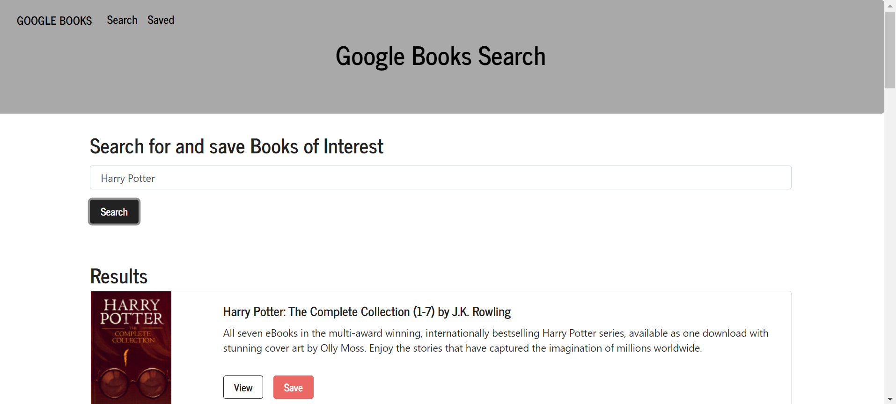
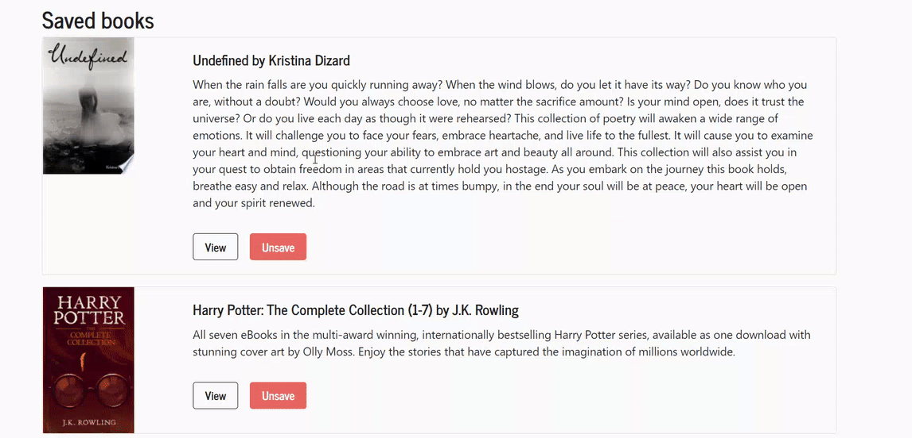

# google-books-search

Google Books Search is a 2 page application that allows users to search for a book, that they would like to read, and then save that book to their saved list. When ready, they can then remove that book from their saved list.

Pages in Application:

Search Page - User can search for books via the Google Books API and render them. User has the option to "View" a book, bringing them to the book on Google Books, or "Save" a book, saving it to the Mongo database.

Saved Page - Renders all books saved to the Mongo database. User has an option to "View" the book, bringing them to the book on Google Books, or "Delete" a book, removing it from the Mongo database.

**GIF of application in use, searching and saving a book**

**GIF of application in use, unsaving a book and refreshing the page**

**Link to the Application, Hosted on Github pages**
https://desolate-atoll-34004.herokuapp.com/

**Credits**
Developer and app creator: Josh Cosson
